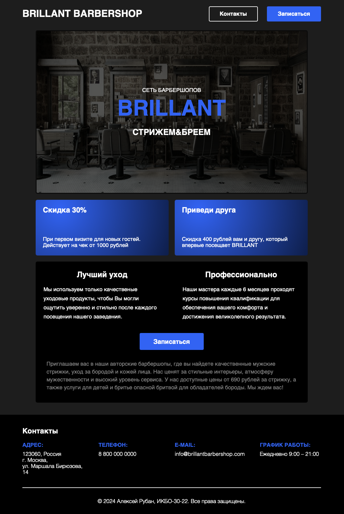
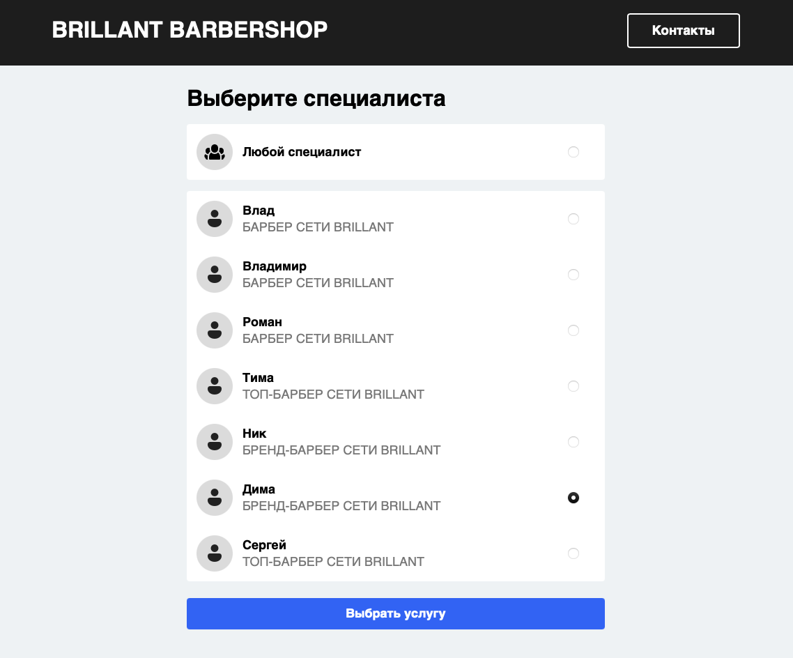
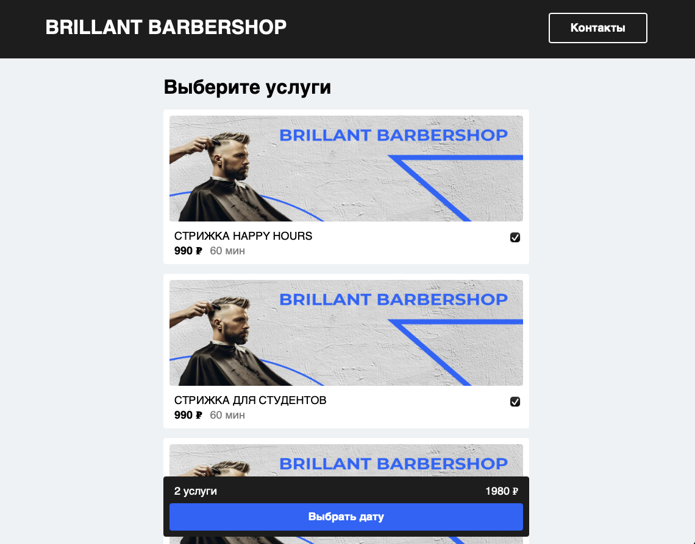
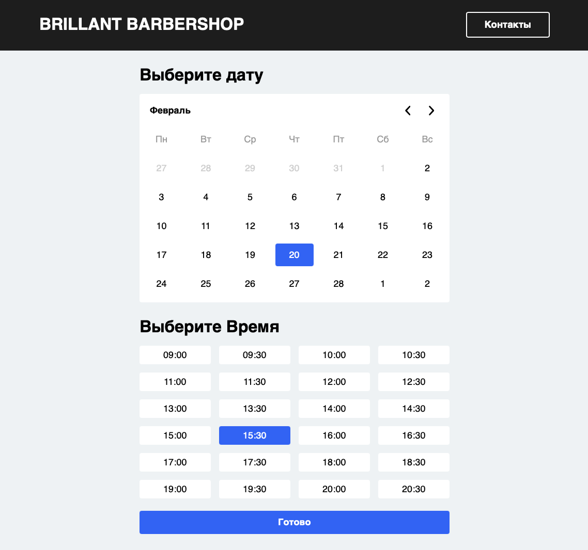
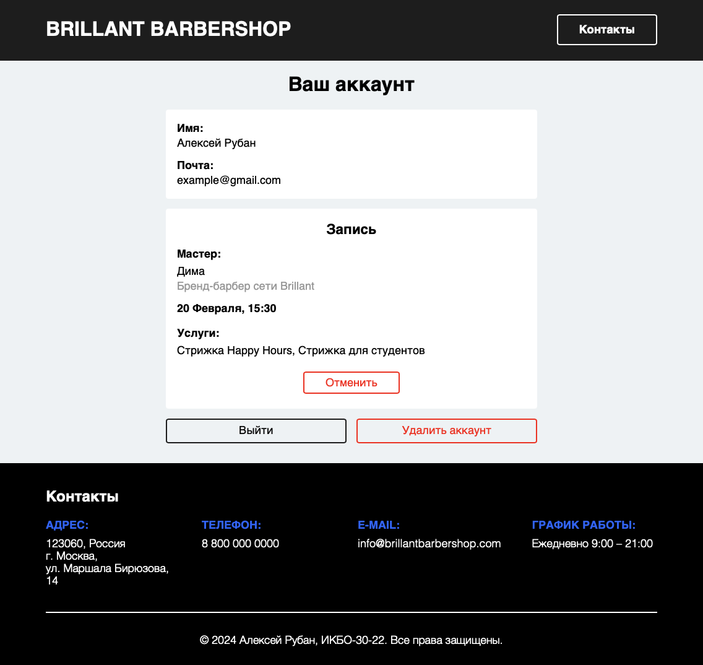

# BrillantBarbershop - Сеть барбершопов

## О проекте
**BrillantBarbershop** — это веб-приложение для записи в сеть барбершопов, позволяющее клиентам удобно оформлять визиты, а администраторам управлять расписанием.

## Технологии
- **Язык**: `Java 21`
- **Фреймворк**: `Spring Boot`
- **Безопасность**: `Spring Security`
- **Шаблонизатор**: `Thymeleaf`
- **База данных**: `PostgreSQL`
- **Сборщик**: `Gradle`
- **Архитектура**: `Monolith`, `MVC`, `Server-Side Rendering (SSR)`

## Функциональность

### Основные страницы
**Главная страница**: контакты, скидки, ссылки на запись.

**Страницы аутентификации**:
  - Регистрация.
  - Авторизация (по email и паролю).
  - Восстановление пароля.

**Запись на услуги**:
  1. Выбор мастера.
  2. Выбор услуг.
  3. Выбор даты и времени (расписание загружается из базы данных).
  4. Перенаправление в аккаунт с оформленным визитом.

**Страница аккаунта**:
  - Просмотр записей.
  - Отмена записи.
  - Выход из аккаунта.
  - Удаление аккаунта.

**Панель администратора**:
  - Управление услугами.
  - Управление мастерами.
  - Управление записями клиентов.
